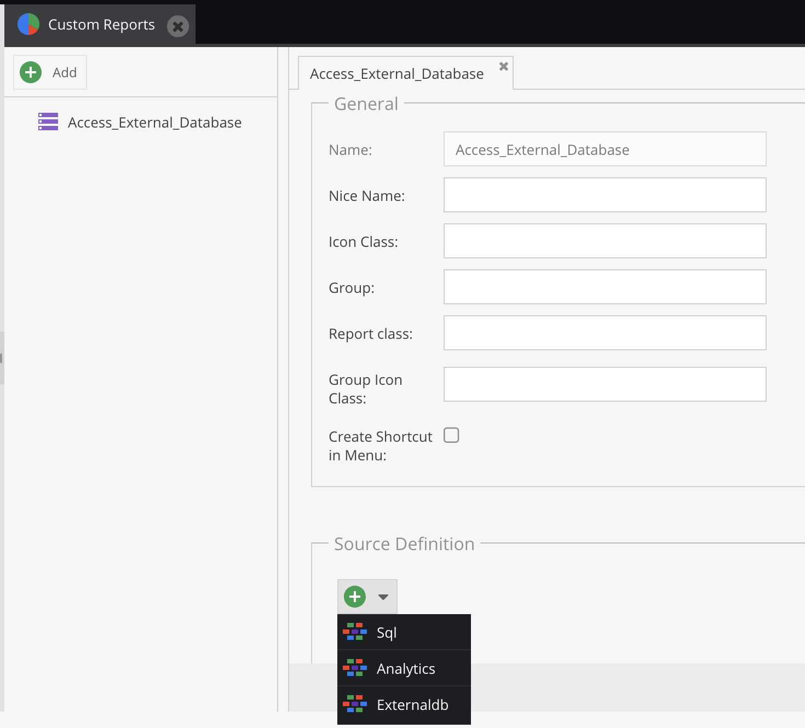
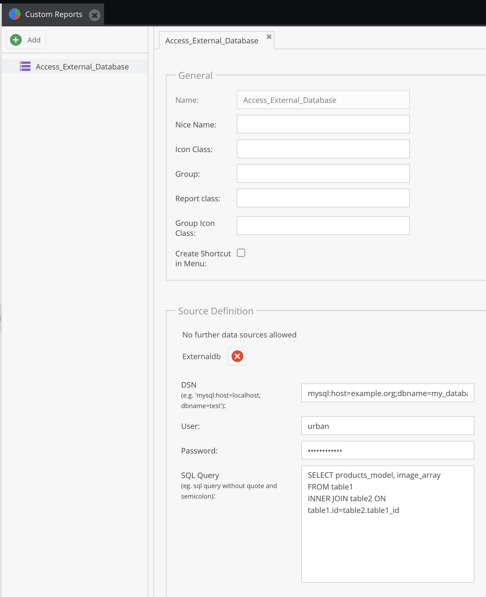
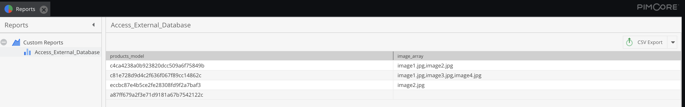

# Report data from external databases

Access data from external databases to be displayed in Pimcore reports

* * *

## What does this plugin do?

With this Pimcore bundle you get an additional [custom report type](https://pimcore.com/docs/pimcore/current/Development_Documentation/Tools_and_Features/Custom_Reports.html) `External Database` on the `Custom reports` page in the Pimcore backend.

It supports all SQL-based databases which are supported by [PDO](https://www.php.net/manual/de/pdo.drivers.php), for example:

* MySQL
* Oracle
* PostgreSQL
* MSSQL
* ODBC
* etc.

As for some SQL features database vendors use different SQL dialects this bundle comes with a simple textarea for entering the SQL query. This allows for example to use `LIMIT` for MySQL or `ROWNUM` for Oracle. Furthermore this allows to execute complex statements with sub-selects, unions etc. which is difficult or even impossible with the standard SQL report adapter which gets shipped with Pimcore - so you can also use this bundle to execute complex queries on the Pimcore database.

## Access external database via Pimcore report
1. Select `Externaldb` as report source

2. Configure external database connection and SQL query

3. Access the external database data as with a usual Pimcore report

In combination with the [Pimcore Data Director bundle](https://pimcore.com/en/developers/marketplace/blackbit_digital_commerce/pimcore-data-director_e103850) you can not only show data from external databases but also import it to Pimcore.

## How to get the plugin

Please write an email to [info@blackbit.de](mailto:info@blackbit.de).